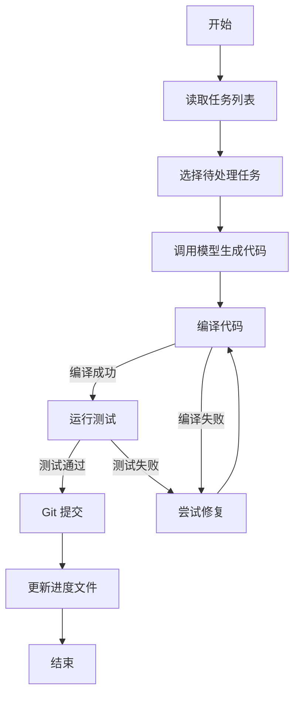

# Latte Code Agent

## 1. 项目概述

Latte Code Agent 是一个基于 Latte 模型的代码生成智能体，用于自动生成代码。本项目采用自举（bootstrap）方式开发，即使用 latte-code-agent 来升级自己。

参考文档：https://www.anthropic.com/engineering/effective-harnesses-for-long-running-agents

### 技术栈

- 语言：TypeScript
- 运行时：Node.js >= 18.0.0
- CLI 框架：Commander.js
- 测试框架：Jest
- 代码风格：ESLint + Prettier
- 模型集成：Claude API, Trae

## 2. 设计理念

Latte Code Agent 基于 **Harness Engineering** 理念设计，通过构建约束机制、反馈回路、工作流控制和持续改进循环，确保 AI Agent 输出的可靠性、一致性和长期可维护性。

### 三层工程概念

- **Prompt Engineering**：关注如何与模型交流
- **Context Engineering**：关注给 Agent 看什么
- **Harness Engineering**：关注系统怎么防崩、怎么量化、怎么修

### 五大工程实践

| 实践 | 机制 | 在本项目中的体现 |
|------|------|-----------------|
| 约束机制 | 任务分解、进度跟踪、测试要求、环境标准化 | feature_list.json、progress.md、测试门禁、init.sh |
| 反馈回路 | 编译反馈、测试反馈、Git 提交验证、进度更新 | run 命令中的编译→测试→提交流程 |
| 工作流控制 | 会话管理、上下文压缩、失败重试、循环执行 | Initializer/Coding Agent 分离、loop 命令 |
| 持续改进 | 统计分析、问题识别、流程优化、自举升级 | state.json、错误分析、用自身升级自身 |
| 量化指标 | 任务完成率、测试覆盖率、执行时间、失败率 | status 命令、测试报告 |

### Agent 失败模式

根据 Anthropic 的研究，Agent 常见的失败模式包括：

1. **试图一步到位（One-shotting）**：一次做完所有事情，上下文窗口耗尽
2. **过早宣布胜利**：看到已有进展就宣布完成，忽略未完成部分
3. **过早标记功能完成**：写完代码就标记完成，未做端到端测试
4. **环境启动困难**：每次新会话花费大量 token 弄清运行环境

### 上下文窗口利用率

上下文填得越满，LLM 输出质量越差。以 168K token 为例：

- **Smart Zone（前约 40%）**：聚焦、准确的推理
- **Dumb Zone（超过约 40%）**：幻觉、循环、格式错误、低质量代码

## 3. CLI 命令

### latte-code-agent init

初始化项目，解析 LATTE.md 并创建项目结构。

```bash
latte-code-agent init
```

生成内容：
- `.latte/` 目录结构
- `feature_list.json` — 功能列表（支持任务分解与并行任务配置）
- `progress.md` — 进度日志
- `state.json` — 状态文件
- 编译和测试框架环境（按语言自动配置，如 C 语言生成 Makefile，Node.js 生成 package.json）
- Git 仓库初始化

可选：生成流程图文档（Mermaid）、生成设计图（绑定任务）

### latte-code-agent run

执行单个任务，生成代码并验证。

```bash
latte-code-agent run              # 自动选择下一个待处理任务
latte-code-agent run -f F001      # 指定任务 ID
latte-code-agent run -m trae      # 指定模型
```

执行流程：选择任务 → 调用模型生成代码 → 编译验证 → 运行测试 → Git 提交 → 更新进度

### latte-code-agent loop

循环执行任务，直到任务列表为空或达到最大迭代次数。

```bash
latte-code-agent loop
latte-code-agent loop --max-iterations 20
```

支持失败重试和延迟执行。

### latte-code-agent test

运行测试框架，生成测试报告。

```bash
latte-code-agent test             # 运行全部测试
latte-code-agent test -f F001     # 运行指定功能的测试
```

支持单元测试、集成测试、E2E 测试。

### latte-code-agent status

显示项目状态、功能完成情况和统计信息。

```bash
latte-code-agent status
```

## 4. 系统架构

### 4.1 Agent 系统

**Initializer Agent（初始化 Agent）**
- 解析 LATTE.md 文件
- 创建项目结构，生成功能列表
- 设置初始环境（init.sh）
- 建立进度跟踪机制（claude-progress.txt）
- 执行初始 Git 提交

**Coding Agent（编码 Agent）**
- 实现单个功能，编写测试代码
- 验证功能正确性（编译 + 测试）
- 更新项目文档和进度文件
- 确保会话结束时环境处于干净状态，为下一个会话留下清晰的工件

### 4.2 状态管理

**feature_list.json（功能列表）**
- 项目名称、创建时间
- 功能列表：ID、描述、优先级、状态、测试用例
- 并行任务组、依赖关系

**progress.md（进度日志）**
- 会话 ID、当前任务
- 已完成工作、遇到的问题、下一步计划
- Git 提交记录

**state.json（状态文件）**
- 版本号、最后运行时间、总会话数
- 执行统计信息（用于持续改进）

### 4.3 模型集成

| 模型 | 集成方式 | 状态 |
|------|---------|------|
| Claude API | @anthropic-ai/sdk，支持自定义提示词和上下文管理（含压缩机制） | 已实现 |
| Trae | 命令行调用，支持自定义参数 | 已实现 |
| Latte | 预留接口 | 待实现 |

### 4.4 Git 集成

- 功能完成后自动提交，清晰的提交信息，原子性提交
- 支持创建功能分支和合并请求

### 4.5 测试系统

- **单元测试**：函数级、模块级测试，覆盖率检查
- **集成测试**：API 测试、服务间通信测试
- **E2E 测试**：用户流程测试、CLI 命令测试

### 4.6 错误处理

- **编译错误**：自动修复 + 重试机制
- **测试失败**：分析失败原因 + 尝试修复
- **依赖问题**：自动安装依赖 + 版本冲突处理

## 5. 任务执行流程



### 失败重试规则

- **run 命令**：执行单个任务，失败时将任务重置为 `pending` 并停止。下次执行 `run` 时自动重试该任务
- **loop 命令**：循环执行任务，单个任务失败时将任务重置为 `pending` 并停止整个循环。下次执行 `loop` 时从失败的任务继续
- **不跳过、不放弃**：任何任务失败都不会被跳过或永久标记为 blocked，确保所有任务最终都会被完成
- 任务只在以下情况标记为 `completed`：agent 成功 + 编译通过 + 测试通过 + 有实际代码变更 + Git 提交成功

### 代码质量要求

每次任务完成须满足：
1. **编译通过**：TypeScript 编译无错误，类型检查通过
2. **测试通过**：单元测试、集成测试通过，覆盖率达标
3. **Git 提交规范**：清晰的提交信息，原子性提交，无无关更改

## 6. 质量要求

### 非功能需求

- **性能**：单个任务 < 5 分钟，支持 100+ 功能项目，内存 < 500MB
- **安全**：API 密钥安全存储，不泄露敏感信息，代码安全检查
- **可扩展**：支持插件系统、自定义 Agent、自定义测试框架
- **可维护**：清晰的代码结构，完善的文档，单元测试覆盖率 > 80%

### 验收标准

- [ ] 所有 CLI 命令正常工作
- [ ] 能够成功初始化项目
- [ ] 能够执行单个任务
- [ ] 能够循环执行所有任务
- [ ] 测试覆盖率 > 80%，所有测试通过
- [ ] 代码编译无错误，ESLint 检查通过
- [ ] 能够自举升级自己

## 7. 开发计划

### Phase 1: 基础框架 ✅
- [x] 创建 CLI 框架
- [x] 实现配置管理
- [x] 实现文件操作工具
- [x] 实现 Git 操作封装

### Phase 2: 初始化功能 ✅
- [x] 实现 LATTE.md 解析器
- [x] 实现功能列表生成器
- [x] 实现项目结构创建
- [x] 实现 Git 初始化

### Phase 3: 任务执行 ✅
- [x] 集成 Claude API
- [x] 实现任务选择逻辑
- [x] 实现代码生成流程
- [x] 实现进度跟踪

### Phase 4: 测试集成 ✅
- [x] 集成 Jest 测试框架
- [x] 实现测试运行器
- [x] 实现测试报告生成
- [x] 实现质量检查

### Phase 5: 优化和完善
- [ ] 完善 Trae 集成
- [ ] 实现 Latte 模型集成
- [ ] 添加更多测试用例
- [ ] 性能优化
- [ ] 文档完善

### Phase 6: 自举升级
- [ ] 使用 latte-code-agent 升级自己
- [ ] 添加新功能
- [ ] 修复已知问题
- [ ] 提升代码质量

## 许可证

MIT License
